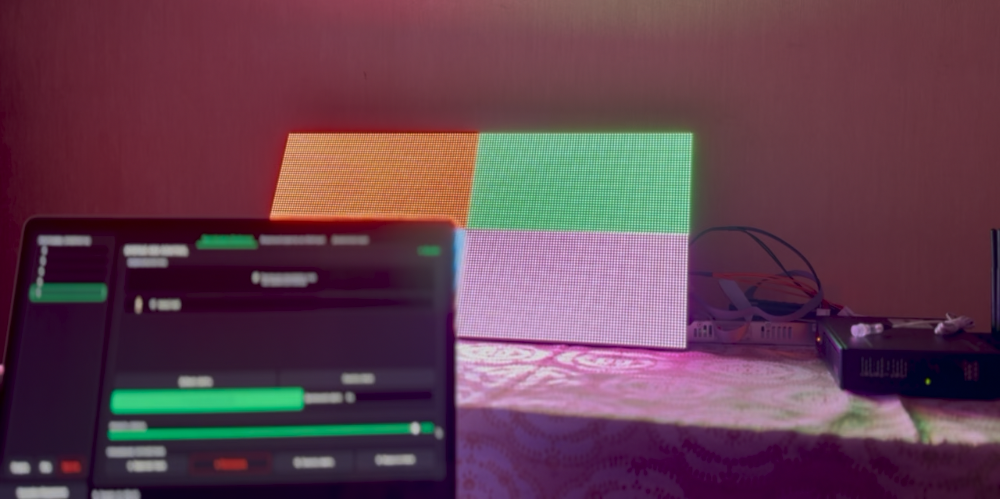
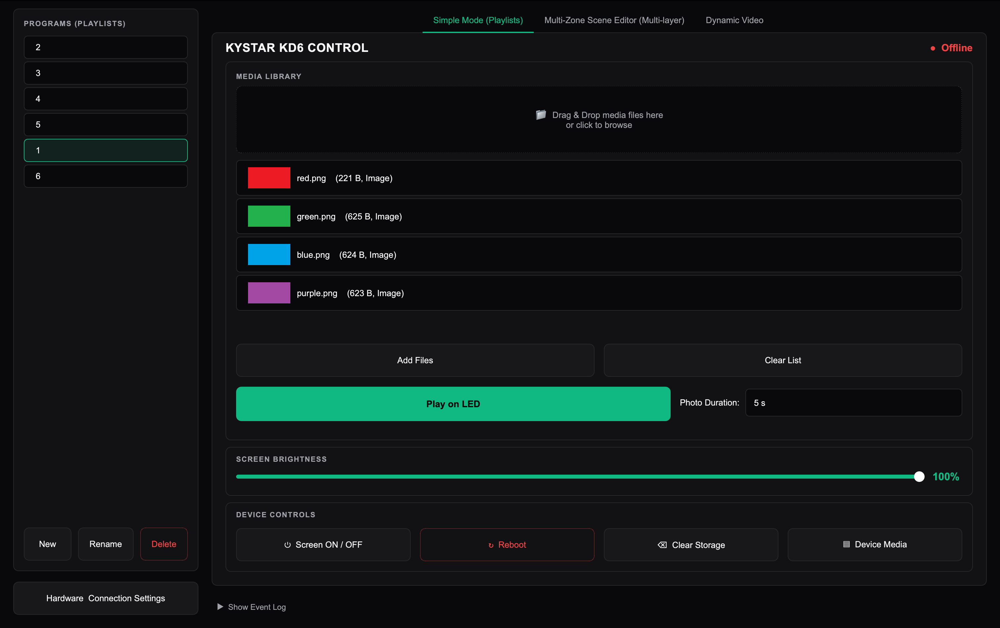
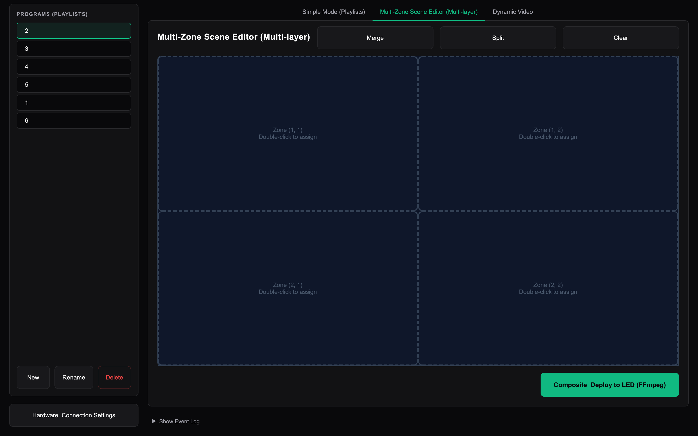
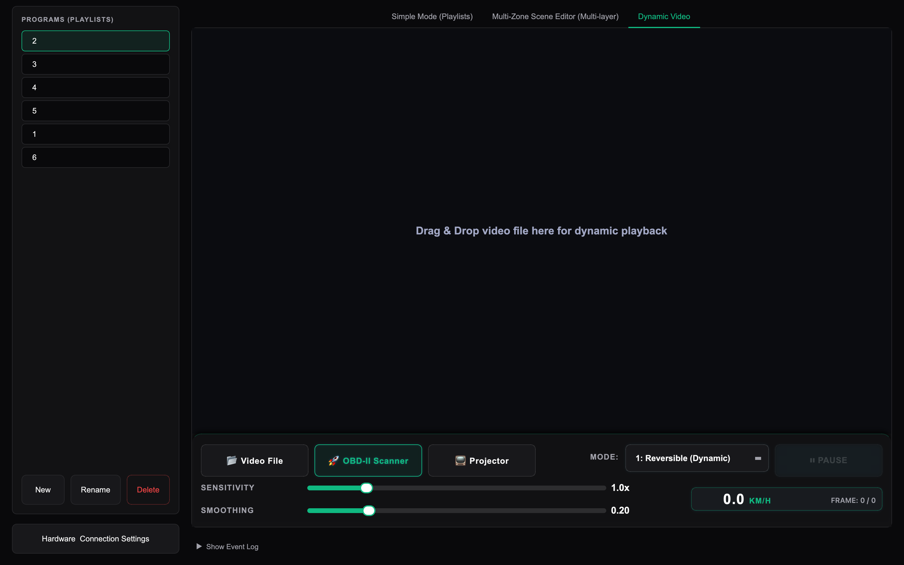
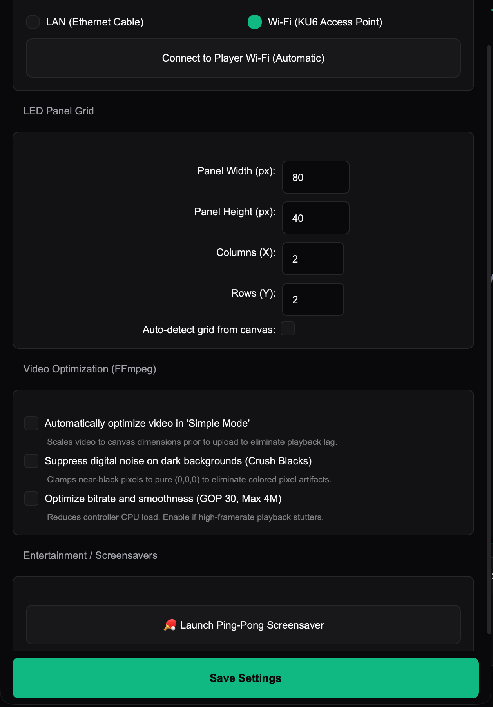

# Beijing Kystar KD6 LED Control Interface

[](https://www.qt.io/)
[](https://ffmpeg.org/)
[](https://www.python.org/)
[](#)
[](#)

A high-performance, multithreaded desktop control station for managing modular LED display panels driven by the **Beijing Kystar KD6** media controller and **Kystar G616** receiving card.

---

## 📷 Physical Hardware Live Verification

The system was verified on a physical 2×2 modular LED display cluster (total resolution **160×80 px**, composed of four 80×40 px P4 modules). The test pattern verifies quadrant coordinate alignment across individual HUB75 receiver ribbon channels:



* **Top-Left (Q1):** Red panel (`assets/test_patterns/panel_q1_red.png` — 80×40 px)
* **Top-Right (Q2):** Green panel (`assets/test_patterns/panel_q2_green.png` — 80×40 px)
* **Bottom-Left (Q3):** Blue panel (`assets/test_patterns/panel_q3_blue.png` — 80×40 px)
* **Bottom-Right (Q4):** Purple panel (`assets/test_patterns/panel_q4_purple.png` — 80×40 px)

---

## 📐 System Topology Diagram

```text
+-----------------------+         HTTP API (Port 18080)         +--------------------+
|   Control Workstation | ====================================> | Beijing Kystar KD6 |
|   (PyQt6 Application) |                                       | (Media Controller) |
+-----------------------+                                       +--------------------+
                                                                          ||
                                                                          || Gigabit LED OUT 1
                                                                          \/
+-----------------------+          HUB75 Ribbon Cable           +--------------------+
|   2x2 LED Display     | <==================================== |    Kystar G616     |
|   (160x80 px Canvas)  |                                       |  (Receiving Card)  |
+-----------------------+                                       +--------------------+
```

---

## ⚙️ Technical Specifications

| Parameter | Specification | Implementation Detail |
| :--- | :--- | :--- |
| **Media Controller** | Beijing Kystar KD6 | Android microcomputer, 6× Gigabit LED OUT ports |
| **Receiving Card** | Kystar G616 | HUB75 interface expansion board, 16× Ports (JH1–JH16) |
| **LED Modules** | P4 Magnetic Matrix | 80 × 40 pixels per module |
| **Active Geometry** | 2 × 2 Panels | Fully scalable via `data/hardware_config.json` |
| **Active Resolution** | 160 × 80 pixels | 12,800 RGB pixels total |
| **Hardware Ceiling** | 30 FPS | Hard limit imposed by the KD6 hardware video decoder |
| **Control Interface** | HTTP REST over LAN | Default IP: `169.254.250.250:18080` (or Wi-Fi AP) |
| **Telemetry Bus** | UDP Port 28765 | Real-time vehicle speed stream for adaptive video |

---

## 🖥 User Interface & Core Modules

### 1. Simple Mode (Playlists & Media Library)
* **Drag-and-Drop Ingestion:** Drag media files directly into the drop zone with real-time format validation (`.mp4`, `.avi`, `.mkv`, `.mov`, `.png`, `.jpg`, `.jpeg`, `.bmp`, `.webp`, `.gif`).
* **Hardware Thumbnail Generation:** Asynchronous thumbnail generator using native FFmpeg frame extraction for videos and high-performance Qt decoders for images.
* **Smart Upload Protocol:** Pre-computes MD5 checksums and file sizes to query the device (`checkUpload`) before transferring, skipping redundant network uploads.
* **Debounced Brightness Control:** Smooth brightness slider (0–100%) with an asynchronous debounce timer (`BRIGHTNESS_DEBOUNCE_MS`) to prevent request flooding.
* **Device Power & Lifecycle:** One-click screen power toggle (ON/OFF), clean controller reboot, and storage wiping.



---

### 2. Multi-Zone Visual Scene Editor (FFmpeg Engine)
* **Dynamic Grid Layout:** Automatically visualizes the physical LED panel matrix (e.g. 2×2, 3×2, 4×4).
* **Interactive Cell Merging & Splitting:** Select contiguous blocks of modules and merge them into custom aspect-ratio viewports.
* **FFmpeg Multi-layer Compositing:** Synthesizes individual zone videos and images into a single pixel-perfect video file aligned to native display dimensions at a constant 30 FPS.
* **Asset Alignment:** Automatic scaling, padding, framerate harmonization, and audio stripping to prevent hardware decoder starvation.



---

### 3. Dynamic Video Subsystem (Adaptive Telemetry Sync)
* **Real-time Speed Sync:** Binds video playback speed and direction to vehicle telemetry received over UDP (port 28765) from an OBD-II scanner or simulation engine.
* **Zero-Lag RAM Caching:** Pre-loads all video frames as uncompressed `QImage` buffers into system memory, eliminating runtime video decoding CPU overhead (0% decoding CPU load).
* **5 Playback Modes:**
  1. `1: Reversible (Dynamic)` — Video accelerates, decelerates, and reverses in real-time with vehicle velocity.
  2. `2: Classic (Forward Only)` — Speed scales with acceleration; braking smoothly slows down without reversing.
  3. `3: Autoplay (Loop)` — Autonomous playback at fixed frame rates with manual play/pause controls.
  4. `4: Reversible (Clamp)` — Directional speed mapping bounded by neutral frame limits.
  5. `5: Centered (Loop)` — Bidirectional loop centered around a midpoint frame.
* **Borderless 1:1 Pixel Mapping Window:** Projector mode allowing pixel-perfect mapping (Letterbox, Stretch, 1:1 Top-Left, 1:1 Centered) for secondary display capture.



---

### 4. Hardware & Connection Settings
* **Network Mode Switcher:** Toggle between **Wired LAN** (`169.254.250.250`) and **Wireless AP** (`KU6-26050021`), with automated Wi-Fi profile provisioning on Windows.
* **Physical Grid Configuration:** Configure base panel dimensions (width/height), columns, and rows with live canvas recomputation.
* **Video Pre-Processing Controls:**
  - *Auto-Optimization:* Downsamples input media to exact canvas dimensions prior to transfer.
  - *Crush Blacks Filter:* Clamps near-black noise pixels to pure `(0,0,0)` to eliminate colored artifacts on OLED/LED displays.
  - *Bitrate & GOP Limiting:* Forces GOP size 30 and bitrates under 4 Mbps to safeguard against playback stuttering.
* **Interactive Ping-Pong Screensaver:** Procedurally generates an exact corner-hit DVD bounce animation and streams it directly to the LED display.



---

## 📁 Directory Structure

```text
.
├── assets/
│   └── test_patterns/             # Hardware calibration patterns (80x40 px)
│       ├── panel_q1_red.png       # Quadrant 1 (Top-Left)
│       ├── panel_q2_green.png     # Quadrant 2 (Top-Right)
│       ├── panel_q3_blue.png      # Quadrant 3 (Bottom-Left)
│       └── panel_q4_purple.png    # Quadrant 4 (Bottom-Right)
├── data/                          # Persistent JSON Datastores
│   ├── hardware_config.json       # Physical grid dimensions & video filters
│   └── playlists.json             # Program list and media file associations
├── docs/                          # Architecture & SDK Reference Material
│   ├── screenshots/               # Application UI & hardware photos
│   │   └── hardware_live_test.png # Physical 2x2 display verification photo
│   ├── LAN_secondary_development.md # Complete Beijing Kystar SDK API reference
│   └── Technical_documentation.md   # Hardware architecture & wiring documentation
├── src/                           # Application Source Code
│   ├── core/                      # Business Logic & Infrastructure
│   │   ├── config.py              # Centralized configuration & grid singleton
│   │   ├── ffmpeg_manager.py      # Binary locator & cross-platform environment setup
│   │   ├── ffmpeg_renderer.py     # Multi-zone video compositor & filtergraph engine
│   │   ├── kystar_client.py       # Thread-safe HTTP REST client for Kystar KD6
│   │   ├── media_utils.py         # Media probes, thumbnail extraction & metadata
│   │   └── playlists_manager.py   # Playlist persistence & CRUD manager
│   └── ui/                        # PyQt6 Modern Dark UI Layer
│       ├── device_media_dialog.py # Remote storage manager dialog
│       ├── dynamic_video_tab.py   # Real-time adaptive telemetry video player
│       ├── ffmpeg_download_dialog.py # Automated FFmpeg installer dialog
│       ├── logo.png               # Application branding icon
│       ├── main_window.py         # Primary GUI orchestrator
│       ├── obd_gui_qt.py          # OBD-II scanner & diagnostics dashboard
│       ├── scene_editor.py        # Visual multi-zone grid editor
│       ├── styles.py              # Dark glassmorphic design system (QSS)
│       └── workers.py             # Asynchronous QThread background workers
├── main.py                        # Application entry point & CLI dispatcher
└── requirements.txt               # Python package dependencies
```

---

## 🚀 Getting Started

### Prerequisites
* **Python 3.9+** (Tested on Python 3.9, 3.11, 3.13)
* **FFmpeg**: Required for video rendering, scaling, and thumbnail generation.
  * **macOS:** `brew install ffmpeg`
  * **Linux:** `sudo apt install ffmpeg`
  * **Windows:** Automated download is offered on first startup, or place `ffmpeg.exe` in `tools/ffmpeg/bin/`.

### Installation
1. **Clone the repository:**
   ```bash
   git clone https://github.com/artemhrebeniuk/LED_Control_Panel.git
   cd LED_Control_Panel
   ```

2. **Create a virtual environment:**
   ```bash
   python3 -m venv venv
   source venv/bin/activate  # On Windows: venv\Scripts\activate
   ```

3. **Install dependencies:**
   ```bash
   pip install -r requirements.txt
   ```

### Running the Application
* **Launch the primary Control Station:**
  ```bash
  python main.py
  ```
* **Launch the standalone OBD-II Scanner & Diagnostics Dashboard:**
  ```bash
  python main.py --run-obd-scanner
  ```

---

## 📖 SDK & Hardware Documentation

* For the complete Beijing Kystar LAN HTTP protocol reference, see [docs/LAN_secondary_development.md](docs/LAN_secondary_development.md).
* For physical panel wiring, power distribution, and modular expansion diagrams, see [docs/Technical_documentation.md](docs/Technical_documentation.md).

---

## 📄 License

This project is open-source software licensed under the MIT License.
